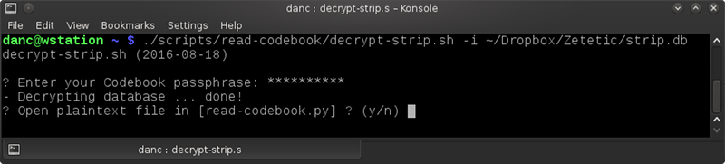
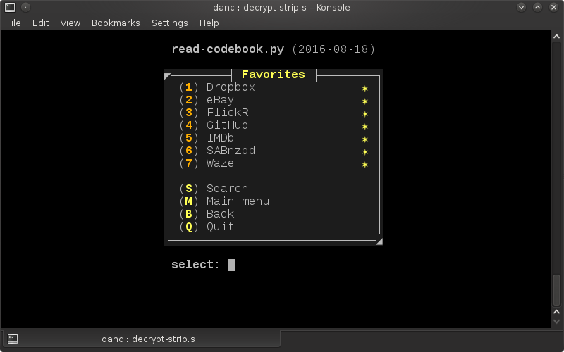

 read-codebook.py
---
This is a combination of **[BASH](https://en.wikipedia.org/wiki/Bash_\(Unix_shell\))** and **[Python](https://en.wikipedia.org/wiki/Python_(programming_language))** scripts to assist the user to decrypt and read through a **[Codebook](https://www.zetetic.net/codebook/)** '**strip.db**' file. The idea is to quickly traverse the dB structure to get to required infomation. This is entirely console based and is easy to use. No modifications to the database are possible. 

This is not a hacking tool - the decryption passphrase must already be known.

---
###**Description:**

1. Ensure your SQLite database file created in **[Codebook](https://www.zetetic.net/codebook/)** ('**strip.db**') is available locally. 

2. Run `./decrypt-strip.sh -i strip.db`

3. Enter the matching **[Codebook](https://www.zetetic.net/codebook/)** passphrase for '**strip.db**'.

3. A decrypted (plaintext) database is then written to '**/dev/shm/decrypt-strip/plaintext.db**'.

4. Open this plaintext dB using the included Python reader to examine the contents. There is an option to write particular entries to text files in the working directory.

5. Quit the reader and delete the plaintext database file.

---
###**Screenshots:**

---
###**Notes:**

As creating a plain-text copy of the database is a security risk, it is recommended that this only be done in a secure environment (i.e. don't run this on Windows), and only if you understand why the risk is there. I do not take any responsibilty for the integrity and security of your data. 

These script were written for my convenience so that I can access the '**strip.db**' file in the event that my iPhone is lost, stolen or damaged. Being able to do so means I'm more likely to store important information in my copy of the great **[Codebook](https://www.zetetic.net/codebook/)** app. 

At this time, I've decided not to use pysqlcipher to reduce the dependance on other packages.

This is also a project for me to learn something about SQL.

---
###**Usage:**

    $ ./decrypt-strip.sh -i [PATHFILE to strip.db]

or, if the database file has already been decrypted:

    $ ./read-codebook.py -i [PATHFILE to plaintext.db]

---
###**Development Environment:**

- [openSUSE](https://www.opensuse.org/) - *13.2 64b*
- GNU BASH - *v4.2.53*
- Geany - *v1.24.1*
- KDE Development Platform - *v4.14.9*
- QT - *v4.8.6*
- SQLCipher - *v3.8.10.2* 
- SQLite - *v3.8.6*
- [Icon Archive](http://www.iconarchive.com/show/crystal-clear-icons-by-everaldo/Action-db-update-icon.html) - script icon

Suggestions / comments / bug reports / advice (are|is) most welcome. :) [email me](mailto:teracow@gmail.com)

---
###**Known Issues:**

- (2016-08-18) - None.
